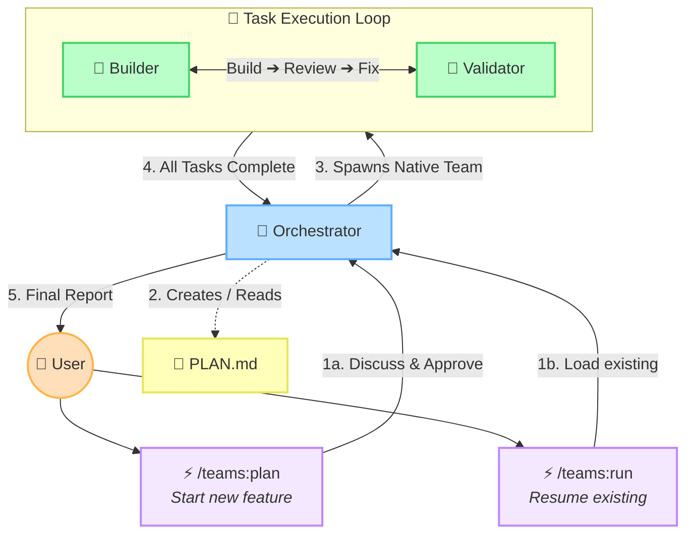

# Default Execution Flow

This diagram illustrates how the plugin operates from top to bottom. It shows how the two primary commands (`/teams:plan` and `/teams:run`) feed into the Orchestrator, which then manages the execution loop.

