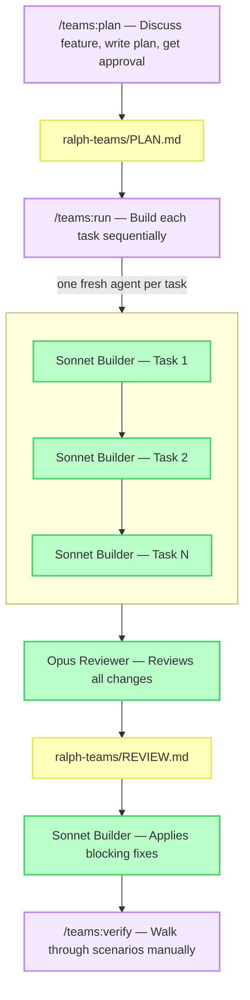

# Execution Flow

```mermaid
flowchart TD
    classDef user fill:#ffdfba,stroke:#ffb347,stroke-width:2px,color:#333
    classDef orch fill:#bae1ff,stroke:#5facff,stroke-width:2px,color:#333
    classDef agent fill:#baffc9,stroke:#42d669,stroke-width:2px,color:#333
    classDef doc fill:#ffffba,stroke:#e6e65a,stroke-width:2px,color:#333
    classDef cmd fill:#f3e8ff,stroke:#c084fc,stroke-width:2px,color:#333

    P1["/teams:plan — Discuss feature, write plan, get approval"]:::cmd
    P["ralph-teams/PLAN.md"]:::doc

    P1 --> P

    P2["/teams:run — Build each task sequentially"]:::cmd

    P --> P2

    subgraph Build[" "]
        direction TB
        B1["Sonnet Builder — Task 1"]:::agent
        B2["Sonnet Builder — Task 2"]:::agent
        BN["Sonnet Builder — Task N"]:::agent
        B1 --> B2 --> BN
    end

    P2 -->|"one fresh agent per task"| Build

    R["Opus Reviewer — Reviews all changes"]:::agent
    REV["ralph-teams/REVIEW.md"]:::doc
    BF["Sonnet Builder — Applies blocking fixes"]:::agent

    Build --> R
    R --> REV
    REV --> BF

    P3["/teams:verify — Walk through scenarios manually"]:::cmd
    BF --> P3
```
