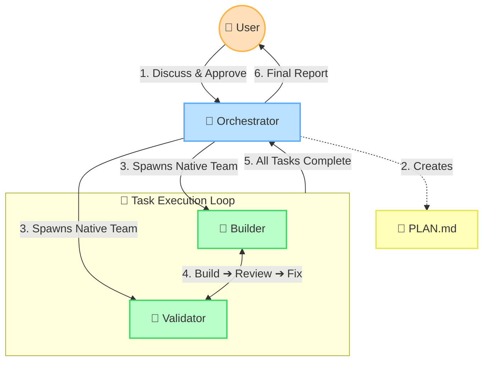

# Default Execution Flow

This diagram provides a high-level, abstract overview of how the `/teams:plan` skill operates. The Orchestrator handles planning and user interaction, while the Builder and Validator communicate directly to complete tasks.

