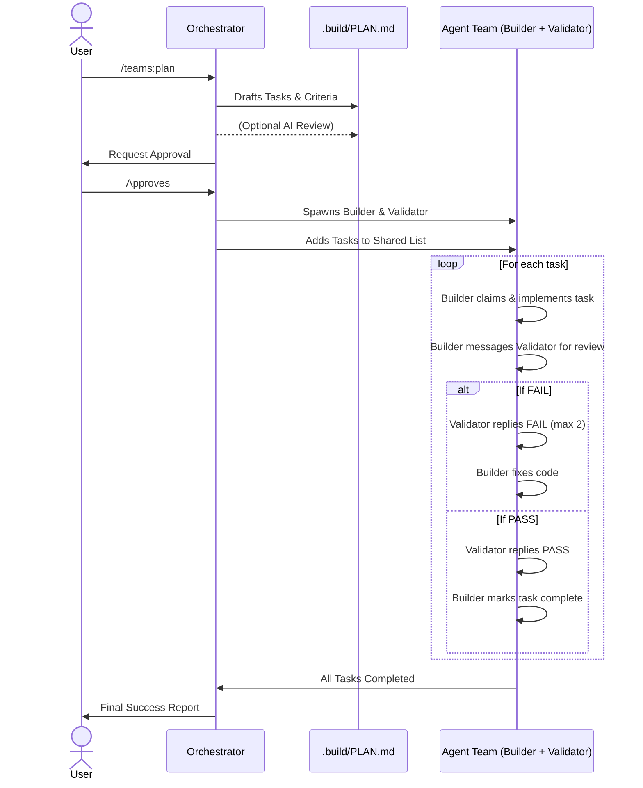

# Default Execution Flow

This diagram illustrates the sequential flow for the `/teams:plan` skill, which relies on Native Agent Teams. The Orchestrator drives the high-level plan, while the Builder and Validator operate in a task-completion loop.

