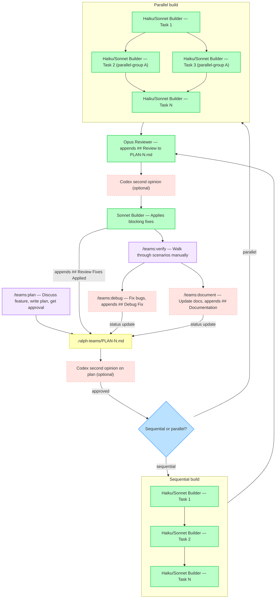

# Execution Flow

```mermaid
flowchart TD
    classDef user fill:#ffdfba,stroke:#ffb347,stroke-width:2px,color:#333
    classDef orch fill:#bae1ff,stroke:#5facff,stroke-width:2px,color:#333
    classDef agent fill:#baffc9,stroke:#42d669,stroke-width:2px,color:#333
    classDef doc fill:#ffffba,stroke:#e6e65a,stroke-width:2px,color:#333
    classDef cmd fill:#f3e8ff,stroke:#c084fc,stroke-width:2px,color:#333
    classDef optional fill:#ffe4e1,stroke:#ff9999,stroke-width:1px,stroke-dasharray:4,color:#333

    P1["/teams:plan — Discuss feature, write plan, get approval"]:::cmd
    P[".ralph-teams/PLAN-N.md"]:::doc
    CX1["Codex second opinion on plan (optional)"]:::optional
    MODE{"Sequential or parallel?"}:::orch

    P1 --> P
    P --> CX1
    CX1 -->|"approved"| MODE

    subgraph SeqBuild["Sequential build"]
        direction TB
        SB1["Haiku/Sonnet Builder — Task 1"]:::agent
        SB2["Haiku/Sonnet Builder — Task 2"]:::agent
        SBN["Haiku/Sonnet Builder — Task N"]:::agent
        SB1 --> SB2 --> SBN
    end

    subgraph ParBuild["Parallel build"]
        direction TB
        PB1["Haiku/Sonnet Builder — Task 1"]:::agent
        PB2["Haiku/Sonnet Builder — Task 2 (parallel-group A)"]:::agent
        PB3["Haiku/Sonnet Builder — Task 3 (parallel-group A)"]:::agent
        PBN["Haiku/Sonnet Builder — Task N"]:::agent
        PB1 --> PB2
        PB1 --> PB3
        PB2 --> PBN
        PB3 --> PBN
    end

    MODE -->|"sequential"| SeqBuild
    MODE -->|"parallel"| ParBuild

    R["Opus Reviewer — appends ## Review to PLAN-N.md"]:::agent
    CX2["Codex second opinion (optional)"]:::optional
    BF["Sonnet Builder — Applies blocking fixes"]:::agent

    SeqBuild --> R
    ParBuild --> R
    R --> CX2
    CX2 --> BF
    BF -->|"appends ## Review Fixes Applied"| P

    P3["/teams:verify — Walk through scenarios manually"]:::cmd
    DBG["/teams:debug — Fix bugs, appends ## Debug Fix"]:::optional
    DOCS["/teams:document — Update docs, appends ## Documentation"]:::optional

    BF --> P3
    P3 --> DBG
    P3 --> DOCS
    DBG -->|"status update"| P
    DOCS -->|"status update"| P
```
