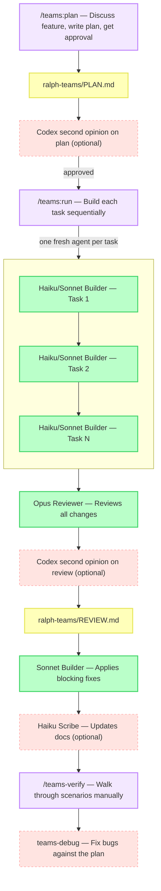

# ralph-teams

A Claude Code plugin that plans and builds features using sequential builder subagents (Haiku or Sonnet based on task complexity), automated E2E verification, an Opus code review pass, and manual verification with integrated debug.

## Quick Start

```
/teams:plan
```

That's it. Describe what you want to build — Claude handles the rest.

---

## Quick Install

Inside Claude Code, run:

```
/plugin marketplace add tuansondinh/ralph-teams-claude-plugin
/plugin install ralph-teams@ralph-teams-claude-plugin
```

Then run `/teams:plan` in any project.

---

## How it works



Each task runs in its own isolated subagent with a clean 200k token context window. Results are committed after each task so you can always resume with `/teams:run`.

---

## Commands

| Command | What it does |
|---------|-------------|
| `/teams-plan` | Discuss → plan → optional AI review → approve → build → Opus review → fixes |
| `/teams-run` | Resume an existing plan from where it left off |
| `/teams-verify` | Walk through manual E2E verification scenario by scenario |
| `/teams-debug` | Fix a bug in relation to the active plan — usable anytime |
| `/teams-document` | Update existing docs (README, ARCHITECTURE.md, etc.) for the latest plan |

---

## Progress output

```
━━━━━━━━━━━━━━━━━━━━━━━━━━━━━━━━━━━━━━━
  RALPH-TEAMS  Plan #3 — 2 of 4 tasks complete
━━━━━━━━━━━━━━━━━━━━━━━━━━━━━━━━━━━━━━━
  ✓  Task 1: Project Setup          [done]        (haiku)
  ✓  Task 2: Auth System            [done]        (sonnet)
  ►  Task 3: API Routes             [building...]  (sonnet)
  ○  Task 4: Frontend               [pending]      (haiku)
━━━━━━━━━━━━━━━━━━━━━━━━━━━━━━━━━━━━━━━
```

`✓` done · `►` building · `✗` failed · `○` pending · `(haiku)` simple task · `(sonnet)` standard task

---

## Output files

All build artifacts are written to `./ralph-teams/` in your project:

| File | Contents |
|------|----------|
| `ralph-teams/PLAN.md` | Plan ID, tasks with complexity, acceptance criteria, verification scenarios |
| `ralph-teams/REVIEW.md` | Opus reviewer findings (blocking / non-blocking) |
| `ralph-teams/VERIFY.md` | Manual verification results |
