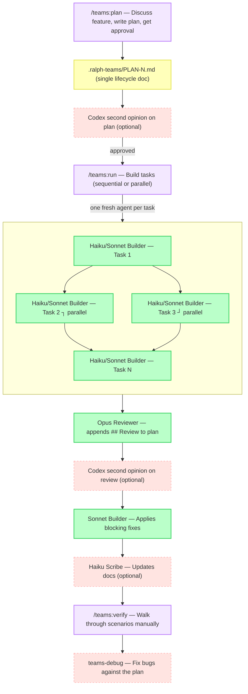

# ralph-teams

A Claude Code plugin that plans and builds features using sequential or parallel builder subagents (Haiku or Sonnet based on task complexity). Each task is broken into subtasks the builder works through in one session — automated E2E verification, an Opus code review pass, and manual verification with integrated debug. The entire lifecycle (build, review, verify, debug, docs) is tracked in a single plan file.

## Quick Start

```
/teams:plan
```

That's it. Describe what you want to build — Claude handles the rest.

---

## Quick Install

Inside Claude Code, run:

```
/plugin marketplace add tuansondinh/ralph-teams-claude-plugin
/plugin install ralph-teams@ralph-teams-claude-plugin
```

Then run `/teams:plan` in any project.

---

## How it works



Each task runs in its own isolated subagent with a clean 200k token context window. Tasks are meaningful feature areas broken into subtasks — the builder completes all subtasks within one session. Results are committed after each task so you can always resume with `/teams:run`.

---

## Commands

| Command | What it does |
|---------|-------------|
| `/teams:plan` | Discuss → plan → optional AI review → approve → build → Opus review → fixes |
| `/teams:run` | Resume an existing plan from where it left off |
| `/teams:verify` | Walk through manual E2E verification scenario by scenario |
| `/teams:debug` | Fix a bug in relation to the active plan — usable anytime |
| `/teams:document` | Update existing docs (README, ARCHITECTURE.md, etc.) for the latest plan |

---

## Parallel mode

When planning, independent tasks are annotated with `parallel-group`. Before execution starts, you choose:

- **Sequential** — tasks run one at a time (default, safer)
- **Parallel** — tasks in the same group run simultaneously

```
━━━━━━━━━━━━━━━━━━━━━━━━━━━━━━━━━━━━━━━
  RALPH-TEAMS  2 of 5 tasks complete  [PARALLEL]
━━━━━━━━━━━━━━━━━━━━━━━━━━━━━━━━━━━━━━━
  ✓  Task 1: Project Setup          [done]        (haiku)
  ►  Task 2: Auth System            [building...] (sonnet) ┐ parallel-group A
  ►  Task 3: DB Schema              [building...] (haiku)  ┘
  ○  Task 4: API Routes             [pending]     (sonnet)
━━━━━━━━━━━━━━━━━━━━━━━━━━━━━━━━━━━━━━━
```

---

## Progress output

```
━━━━━━━━━━━━━━━━━━━━━━━━━━━━━━━━━━━━━━━
  RALPH-TEAMS  Plan #3 — 2 of 4 tasks complete
━━━━━━━━━━━━━━━━━━━━━━━━━━━━━━━━━━━━━━━
  ✓  Task 1: Project Setup          [done]        (haiku)
  ✓  Task 2: Auth System            [done]        (sonnet)
  ►  Task 3: API Routes             [building...]  (sonnet)
  ○  Task 4: Frontend               [pending]      (haiku)
━━━━━━━━━━━━━━━━━━━━━━━━━━━━━━━━━━━━━━━
```

`✓` done · `►` building · `✗` failed · `○` pending · `(haiku)` simple task · `(sonnet)` standard task

---

## Plan file — single lifecycle document

Everything is tracked in one file per feature: `.ralph-teams/PLAN-N.md`. Each stage appends a section as it completes:

| Section | Appended by |
|---------|-------------|
| Tasks, criteria, scenarios | Orchestrator at plan creation |
| `## Review` | Opus reviewer after build |
| `## Review Fixes Applied` | Orchestrator after fix-pass |
| `## Verification` | Verify skill after manual walkthrough |
| `## Debug Fix` | Debug skill after each bug fix |
| `## Documentation` | Document skill after scribe runs |

No separate `REVIEW.md` or `VERIFY.md` — the plan is the full record from start to finish.
